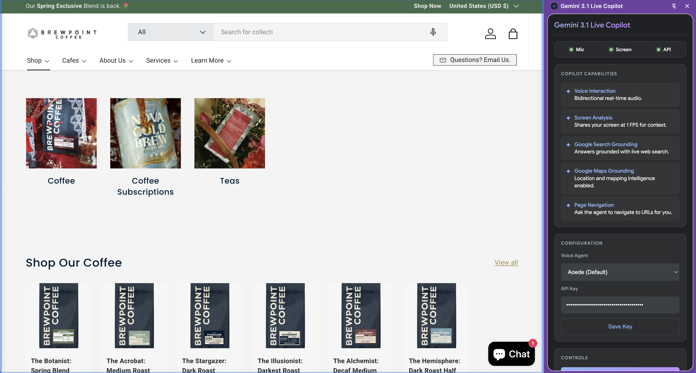

# Gemini Live Copilot

A premium Chrome Extension enabling real-time, bidirectional voice interaction and intelligent screen analysis with the Gemini Live API. Transform your browser into a powerful AI-driven copilot experience.

## 🚀 Key Features

- 🎙️ **Real-Time Voice**: Ultra-low latency bidirectional audio streaming (16kHz in, 24kHz out).
- 🖥️ **Screen Intelligence**: Shares your active screen at 1 FPS for visual context.
- 🔍 **Search Grounding**: Real-time answers powered by Google Search.
- 🗺️ **Maps Grounding**: Location and mapping intelligence enabled.
- 🧭 **Active Navigation**: The agent can navigate to URLs on your behalf via function calling.
- 🛑 **Smart Barge-in**: Instantly halts playback when you speak over the agent.

## 🛠️ Quick Setup

1. **Download**: Clone or download this repository to your local machine.
2. **Load Extension**:
   - Open Chrome and navigate to `chrome://extensions/`.
   - Enable **Developer mode** (toggle in the top right).
   - Click **Load unpacked** and select the project folder.
3. **Configure**:
   - Open the extension from the Chrome Side Panel.
   - Enter your **Gemini API Key** and click **Save Key**.

## 💡 How to Use

1. **Connect**: Click the **Connect** button to establish the WebSocket session.
2. **Speak**: Click **Enable Microphone** and start talking!
3. **Share**: Click **Start Screen Share** to let the agent see what you see.
4. **Command**: Ask the agent to "Navigate to [URL]" or ask questions about your screen!

## 📚 Documentation & References

- [Gemini Live API Overview](https://ai.google.dev/gemini-api/docs/live-api)
- [WebSockets API Reference](https://ai.google.dev/api/rest/v1beta/models/bidiGenerateContent)

---
*Built with ❤️ for the next generation of AI interaction.*
